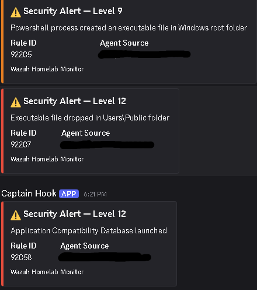

# Cloud-Native SIEM Telemetry Pipeline & Custom API Handler

## 📋 Project Overview
This project demonstrates the design, deployment, and optimization of a cloud-native Security Information and Event Management (SIEM) telemetry pipeline. The architecture links a local Windows 11 endpoint to an enterprise-grade log collection engine hosted in the cloud, utilizing kernel-level event auditing to capture advanced host manipulation tactics. High-severity threats are surgically parsed and distributed to an operational engineering channel via a custom Python 3 native API integration.



### Key Infrastructure Capabilities
- **Proactive Boundary Telemetry:** Secure, cross-platform log transport spanning cloud perimeters and local endpoints.
- **Kernel-Level Audit Depth:** Advanced process, network, and file integrity tracing via Microsoft Sysmon.
- **Micro-Engineered Alerting:** A native Python automated handler that bypasses brittle legacy compatibility frameworks to provide zero-loss JSON payload delivery.
- **Framework Alignment:** Automatic behavioral mapping to the **MITRE ATT&CK Matrix**.

---

## 🏗️ System Architecture & Data Flow

1. **Endpoint Generation:** Microsoft Sysmon monitors kernel activities on the Windows host and records events to the `Microsoft-Windows-Sysmon/Operational` event channel.
2. **Log Ingestion & Transport:** The local Wazuh Agent monitors the Sysmon event log channel in real time and ships encrypted logs over the WAN to the cloud manager.
3. **Rules Engine & Analysis:** The Cloud Wazuh Manager processes incoming events against built-in and user-configured signature rule sets.
4. **Integration Daemon Activation:** When an event meets or exceeds the defined severity gate (Level 7), the manager invokes the background integration daemon (`wazuh-integratord`).
5. **API Delivery:** The custom Python integration script formats the alert payload into a native Discord Embed structure and executes an HTTP POST to the live webhook target.

---

## 🛠️ Components & Technologies
- **SIEM Core:** Wazuh Manager & Agent (v4.x)
- **Host Telemetry Engine:** Microsoft Sysmon (v15.20) + SwiftOnSecurity Configuration Framework
- **Cloud Infrastructure:** Ubuntu Server hosted on Oracle Cloud Infrastructure (OCI)
- **Automation & Scripting:** Python 3 (using `requests`, `sys`, and `json` modules)
- **Alert Target:** Discord Native Webhook API

---

🔧 Engineering Obstacles & Triage Chronicles
💥 Challenge 1: Webhook Payload Drop (HTTP Response 400)
Symptom: The integration engine logged failures when communicating with Discord's /slack compatibility endpoint.

Root Cause: When processing Windows logs, certain rule sets generated an empty text body structure ("text": null). Discord's translation layer strictly rejects null entries or non-compliant time syntax, dropping the entire packet.

Resolution: Scrapped the legacy compatibility wrapper entirely. Engineered a native Python script to directly populate clean Discord schema arrays, integrating fallback string values to gracefully handle unpopulated data blocks.

🕵️‍♂️ Challenge 2: Bash Shell Script Syntax Faults
Symptom: The manager integration tool crashed on execution with Syntax error: "(" unexpected and import: not found.

Root Cause: Running file /var/ossec/integrations/slack classified the target as a generic POSIX shell script instead of a Python executable. Hidden carriage returns (\r) and UTF-8 Byte Order Marks (BOM) were introduced via clipboard buffer caching, which completely blinded the Linux kernel to the python shebang line, forcing it to fallback to standard Bash.

Resolution: Re-wrote the script structure utilizing a direct sudo tee stream to bypass standard user redirection permissions. Applied target regular expression filtering to strip the hidden format sequences:

(Bash) sudo sed -i '1s/^\xef\xbb\xbf//; s/\r$//' /var/ossec/integrations/slack
This immediately re-established proper system classification: Python script, ASCII text executable.

🚫 Challenge 3: Host Subscription Failure (Error 15007)
Symptom: Endpoint agent logs displayed initialization blocks: ERROR: Could not EvtSubscribe() for Microsoft-Windows-Sysmon/Operational.

Root Cause: The local Windows event manager error maps to ERROR_EVT_CHANNEL_NOT_FOUND. The background service installer had loaded the raw binary but had failed to register its underlying log provider manifest with the host OS.

Resolution: Launched an elevated Administrator shell instance, purged stale software artifacts, and manually forced a clean registration alongside SwiftOnSecurity's rule metrics:

(powershell).\Sysmon64.exe -i sysmonconfig-export.xml -accepteula
Verified channel activation via Get-WinEvent before executing an agent service recycle to bind the subscription handle.

🔬 Adversary Simulation & Validation Testing
To test the resilience of the pipeline against defensive evasion mechanics, a high-severity indicator simulation was launched on the Windows host. This tested the file generation and execution pipeline out of an unauthorized administrative directory (C:\Users\Public).
(Powershell)
# 1. Stage duplicate binary inside unauthorized environment
copy C:\Windows\System32\cmd.exe C:\Users\Public\patched_explorer.exe

# 2. Execute process to trigger severity alarm
C:\Users\Public\patched_explorer.exe /c "echo AdversarySimulation"

# 3. Perform cleanup
remove-item C:\Users\Public\patched_explorer.exe

Incident Timeline Responses
1. Detection: Sysmon intercepted the file creation anomaly and generated Event ID 11 (FileCreate).

2. Analysis: The cloud manager parsed the payload, matched signature criteria, and assigned a critical Level 12 threat flag, mapping it to MITRE ATT&CK Technique T1105 (Ingress Tool Transfer).

3. Distribution: The custom Python script instantly fired, mapping the Level 12 state to a high-severity red embed card, landfalling the alert package into the Discord operations channel within three seconds of localized endpoint execution.

---

## 💻 Script Configuration: Native Discord Integration

This script sits at `/var/ossec/integrations/slack` on the cloud manager. It replaces the legacy Slack-translation wrapper to communicate natively with Discord's API, eliminating syntax failures induced by unmapped or null event fields.

```python
#!/usr/bin/env python3
import sys
import json
import requests

# Read the arguments passed by the Wazuh daemon
alert_file = sys.argv[1]
hook_url = sys.argv[3]

# Read and parse the raw alert JSON data
with open(alert_file, 'r') as f:
    alert = json.load(f)

# Extract core metadata safely with default fallbacks
description = alert.get('rule', {}).get('description', 'Wazuh Security Alert')
rule_id = alert.get('rule', {}).get('id', 'N/A')
level = alert.get('rule', {}).get('level', 0)
agent_name = alert.get('agent', {}).get('name', 'Cloud Manager')
agent_id = alert.get('agent', {}).get('id', '000')

# Dynamically set embed card color based on severity levels
if level >= 10:
    card_color = 15158332  # Red for high severity threats
elif level >= 5:
    card_color = 15105570  # Orange for warning severity
else:
    card_color = 3066993   # Green for low severity informational

# Build a pristine, native Discord Embed payload
payload = {
    "embeds": [
        {
            "title": f"⚠️ Security Alert — Level {level}",
            "description": description,
            "color": card_color,
            "fields": [
                {"name": "Rule ID", "value": str(rule_id), "inline": True},
                {"name": "Agent Source", "value": f"({agent_id}) {agent_name}", "inline": True}
            ],
            "footer": {"text": "Wazuh Homelab Monitor"}
        }
    ]
}

# Ship the native JSON payload directly to Discord
requests.post(hook_url, json=payload)

